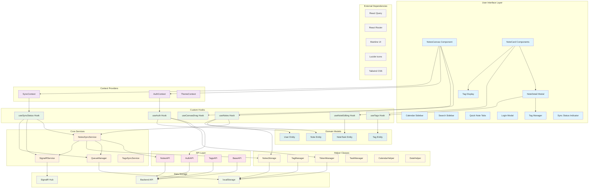
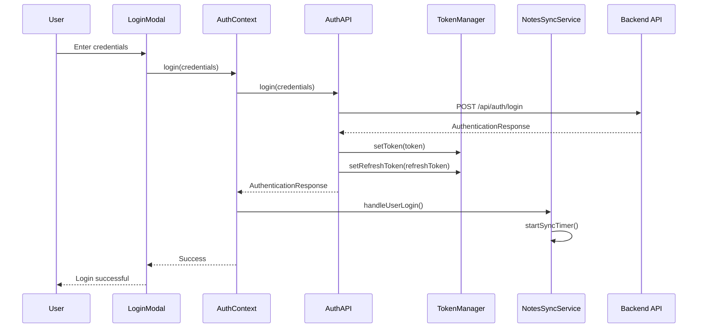
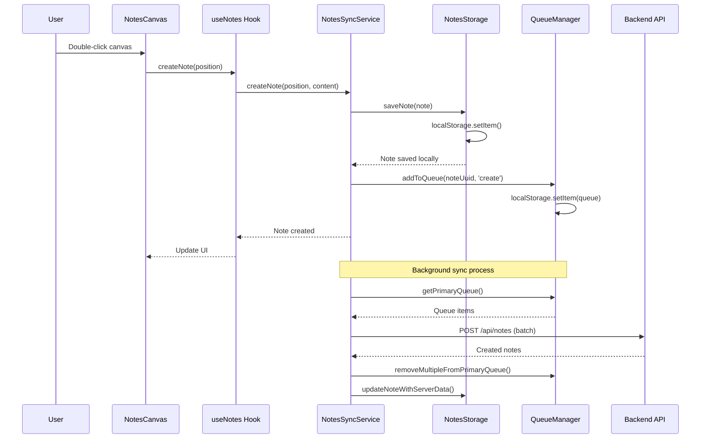
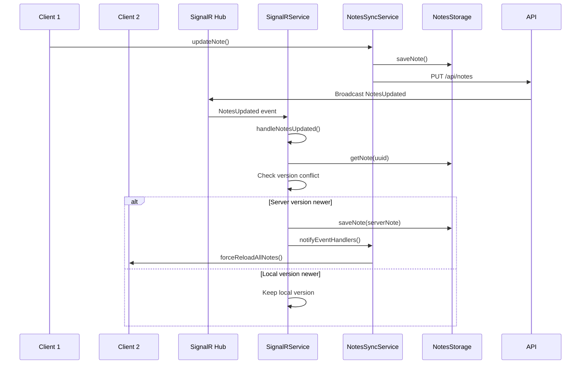
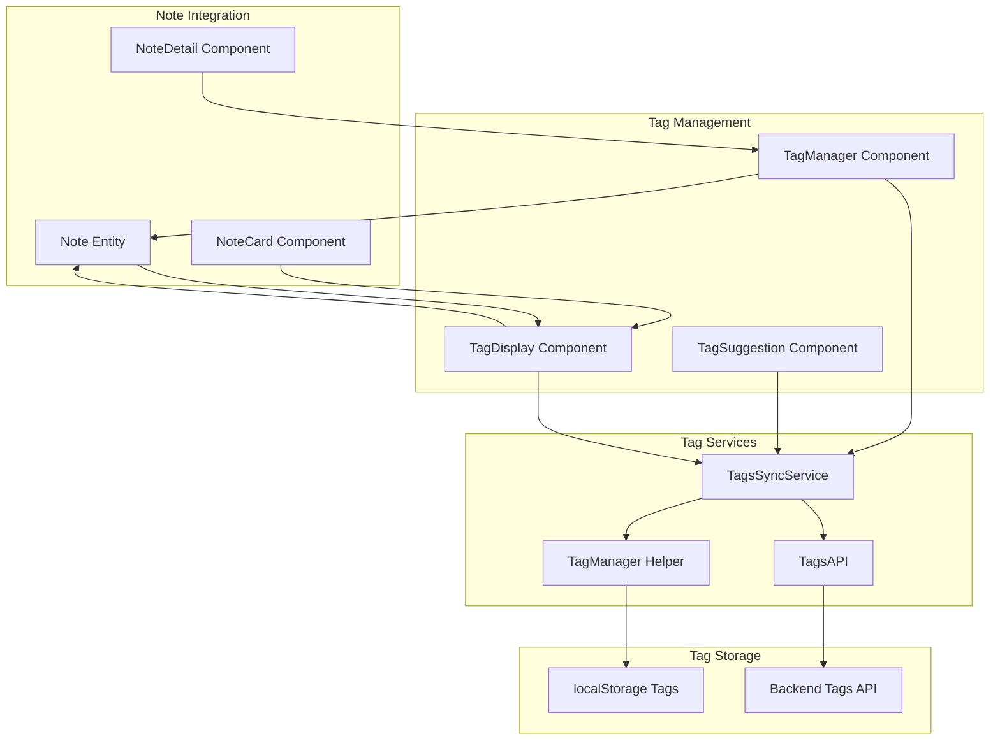
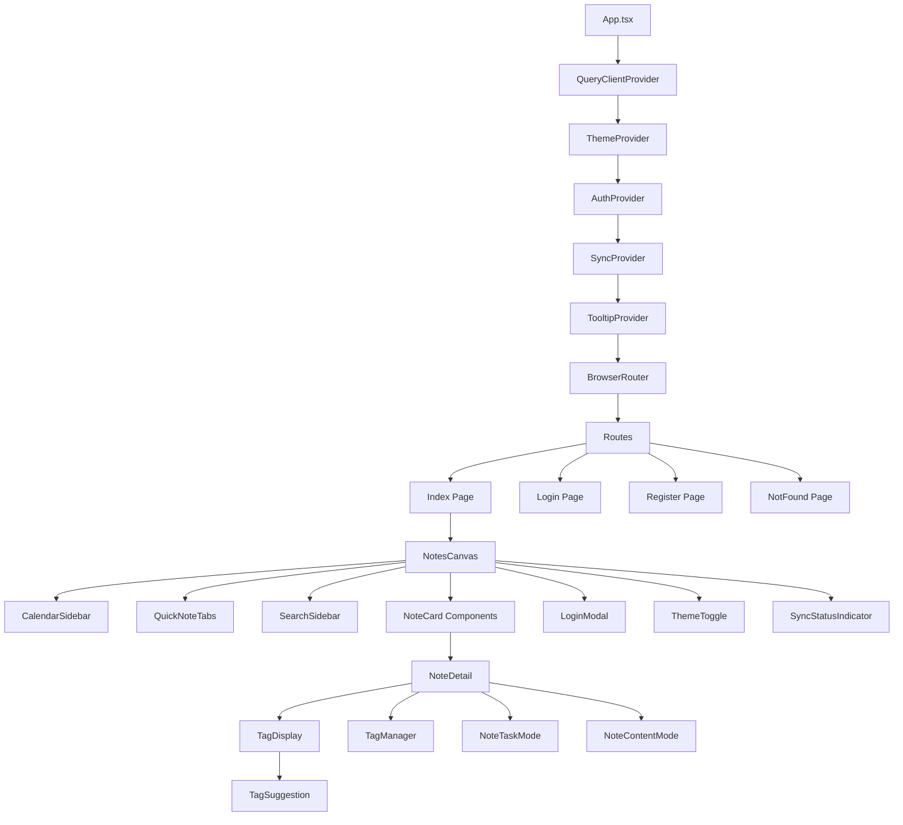
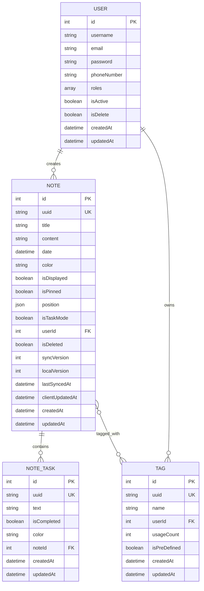
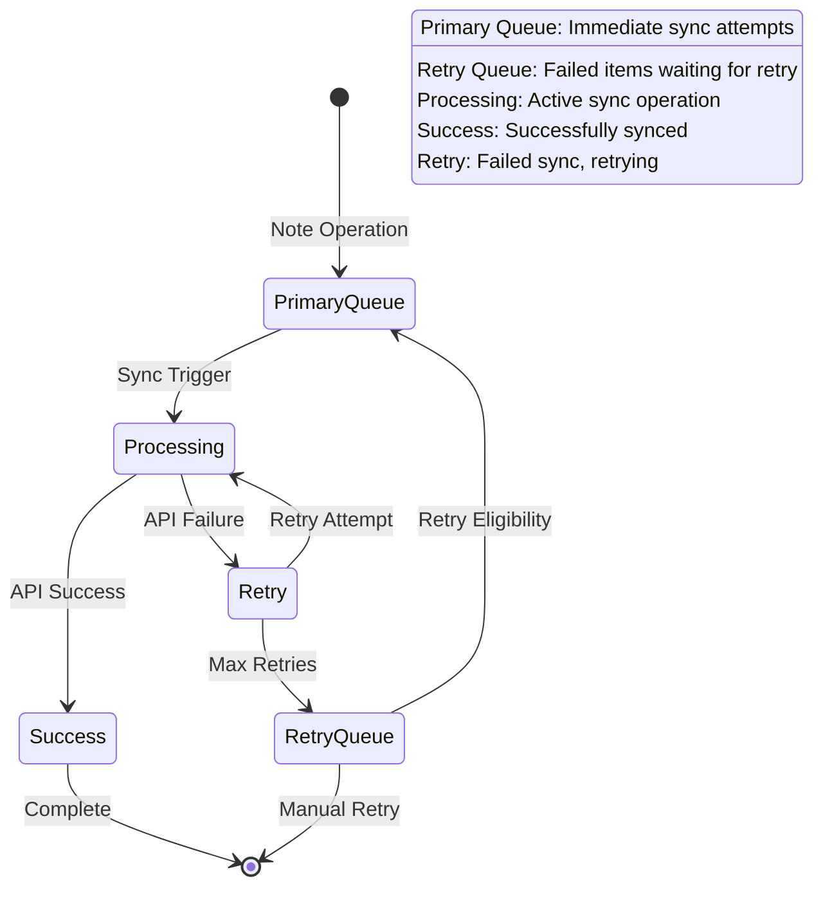

# Draggy Notes Application Logic Diagram

This document contains a comprehensive logic diagram of the Draggy Notes application architecture, showing the complete system flow, components, and data relationships.

## System Architecture Overview

## Authentication Flow

## Note Creation Flow

## Real-time Synchronization Flow

## Offline-First Data Flow

```mermaid
graph LR
    subgraph "Online Mode"
        A[User Action] --> B[Save to localStorage]
        B --> C[Add to Sync Queue]
        C --> D[Background Sync]
        D --> E[Update Server]
        E --> F[Remove from Queue]
    end
    
    subgraph "Offline Mode"
        G[User Action] --> H[Save to localStorage]
        H --> I[Add to Sync Queue]
        I --> J[Queue Persisted]
        J --> K[Wait for Online]
    end
    
    subgraph "Sync Recovery"
        L[Back Online] --> M[Process Queue]
        M --> N[Retry Failed Items]
        N --> O[Sync to Server]
    end
    
    K --> L
    F --> A
    O --> A
```

## Tag System Integration

## Component Hierarchy

## Data Models and Relationships

## Sync Queue Management

This comprehensive diagram shows the complete architecture of the Draggy Notes application, including:

1. **User Interface Layer**: All React components and their relationships
2. **Context Providers**: State management for auth, sync, and theme
3. **Custom Hooks**: Business logic encapsulation
4. **Core Services**: Main application services
5. **API Layer**: Backend communication
6. **Data Storage**: localStorage and backend persistence
7. **Domain Models**: Data structures and relationships
8. **Helper Classes**: Utility functions
9. **External Dependencies**: Third-party libraries

The application follows an offline-first architecture with real-time synchronization, comprehensive authentication, and a robust tag system.
